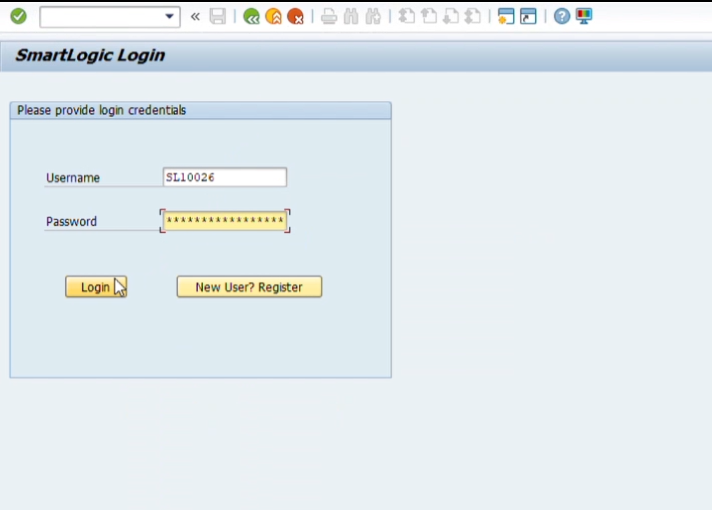

# SAP ABAP Employee Management System

  

## 🔍 Overview  
This project is a Dialog-based application developed using **SAP ABAP** for **SmartLogic** to manage employee records efficiently. It demonstrates real-world use of **SE11 tables**, **module pool programming**, **subroutines**, and **tabstrip controls** to deliver a structured and user-friendly experience within the SAP GUI environment.

## Project video demo link
**Link:** https://youtu.be/4Bmfr4G65w0

## 📘 About ABAP Programming

**ABAP (Advanced Business Application Programming)** is a fourth-generation programming language primarily used for developing and customizing applications within the **SAP ecosystem**. Positioned alongside Java as one of SAP's core backend languages, ABAP programs are executed under the control of the SAP run-time environment and are deeply integrated with the **SAP NetWeaver** platform.

---

## 🌟 Benefits of Using SAP ABAP

- Rapid access to specialized ABAP skills
- Flexibility in resource scaling and demand response
- Efficient resourcing through the factory approach
- Reduced development iteration cycles and cost
- Established standards for **quality assurance**
- Immediate availability of **experienced ABAP consultants**
- Dedicated client engagement models (on-site/offshore)
- Proven ABAP Factory delivery framework

---

## 🔧 Key Features of SAP ABAP

ABAP is highly integrated with SAP NetWeaver and includes powerful tools and services such as:

- **Logical Database Connections**: Enable abstraction from physical databases
- **Open SQL**: Embedded SQL syntax in ABAP, similar to LINQ in .NET, auto-converted to native SQL
- **Internal Tables**: Powerful data structures for handling collections of records
- **Security Integration**: Tightly coupled with SAP NetWeaver security
- **Data Dictionary**: Centralized metadata and business logic repository
- **Change and Transport System (CTS)**: Tracks and manages changes across environments
- **Shared Development System**: All developers work collaboratively on the same set of objects

---
## 🧱 Key Features

### 👤 User Authentication (Screen 0100)
- Login using Employee Number.
- Password format: First name + last 3 digits of EMP_NO.
- Error handling with success/failure messages.

### 📝 Employee Registration (Screen 0200)
- Form-based entry with input validation.
- Email: Minimum 8 characters, at least one digit.
- Password confirmation and EMP_NO auto-generation.
- Fields are disabled after successful registration.

### 📋 Employee Record Management (Screen 0300)
- Department filtering using F4 help (e.g., HR, IT Support).
- Table control with editable Email ID.
- Email validation and confirmation popup before saving.
- Button to access Admin Controls.

### 🛠 Admin Functions (Screen 0400)
- **Insert Tab (0401):** Add new employees with validation.
- **Delete Tab (0402):** Select and delete multiple records.
- Tabstrip for easy navigation with dynamic screen behavior.

## 🧪 Technical Architecture

- **Database Table:** `Z021EMPLOYEE`  
  Fields: EMP_NO (PK), EMP_NAME, GENDER, EMAIL_ID, DEPT.
  
- **Program Structure:**
  - `TOP`: Global data, types.
  - `O01`: PBO modules.
  - `I01`: PAI modules.
  - `F01`: Subroutines (FORM routines) for reusable logic.

- **Screens:**
  - 0100: Login  
  - 0200: Registration  
  - 0300: Employee Records (with popup 0301)  
  - 0400: Admin Functions (with subscreens 0401, 0402)

## ▶️ How to Use

1. Execute the program (e.g., `/nZ544_EMP_MANAGE`).
2. Register a new employee → Login.
3. View and manage records by department.
4. Admin users can insert or delete employee records.

## 🔮 Future Enhancements
- Role-based user access.
- Enhanced reporting features.
- Workflow integration (e.g., approvals).
- Mobile-responsive SAP GUI design.

